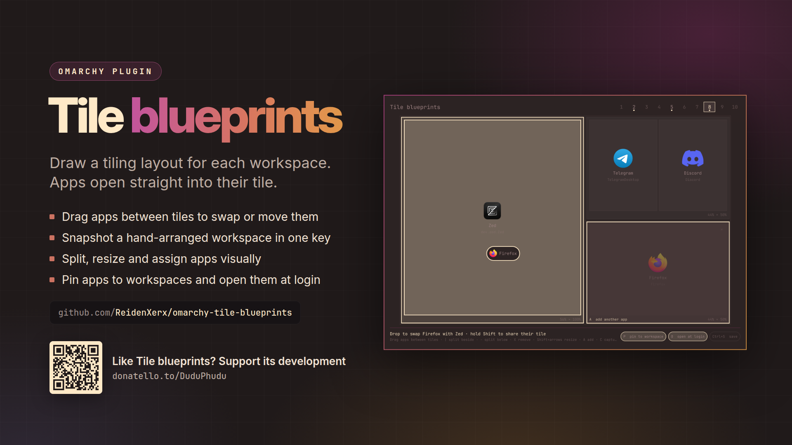

# Tile blueprints



An [Omarchy](https://omarchy.org) editor for **per-workspace tiling layouts**. Draw the tiles
for a workspace, say which app lives in each one, and from then on those apps open
straight into their tile at the proportions you set.

Drag apps between tiles to rearrange them. A workspace you have already arranged by hand
becomes a blueprint in one key: **capture** reads the real window sizes and turns them into
tiles, and **snapshot** does the same straight from the workspace and saves it at once.


## Install

```bash
omarchy plugin add https://github.com/ReidenXerx/omarchy-tile-blueprints.git --enable
```

Bind the editor to a key in `~/.config/hypr/bindings.lua`. `SUPER + ALT + L` is free on
a stock install, next to `SUPER + L` (layout toggle):

```lua
o.bind("SUPER + ALT + L", "Tile blueprints", "omarchy-shell shell toggle reidenxerx.tile-blueprints '{}'")
```

And one to [snapshot](#snapshot-a-workspace) the workspace you are on:

```lua
o.bind("SUPER + ALT + SHIFT + L", "Snapshot workspace", "~/.config/omarchy/plugins/reidenxerx.tile-blueprints/bin/tile-blueprints snapshot")
```

To add its entries to the Omarchy menu as well:

```bash
~/.config/omarchy/plugins/reidenxerx.tile-blueprints/bin/tile-blueprints-menu-install
```

It needs Hyprland 0.56 or newer (Lua config, Lua layouts), plus `/usr/bin/python3` and
`/usr/bin/hyprctl`.

## Use

The editor opens on the workspace you are on, drawn in your screen's proportions.

| key | does |
|---|---|
| `\|` | split the selected tile side by side |
| `-` | split it top and bottom |
| `X` / `Del` | remove the tile; its neighbours take the space |
| `Shift` + arrows | make the tile wider, narrower, taller, shorter |
| drag a divider | set the split with the mouse |
| drag an app | onto another app: swap the two; anywhere else on a tile: move it there (`Shift`: share the other app's tile) |
| drag from the app list | put that app in the tile you drop it on |
| arrows / `hjkl`, `Tab` | select a tile |
| `A` / `Enter` / double-click | add an app to the tile (running apps first) |
| `Backspace`, or an app's `×` | take the last app out, or that one |
| `C` | **capture**: build the blueprint from the windows on this workspace |
| `P` | pin: the apps always open on this workspace |
| `O` | open these apps at login |
| `1`–`9`, `0` | edit another workspace |
| `Ctrl` + `S` | save and apply |
| `Ctrl` + `Del` | clear this workspace's blueprint |
| `Esc` | close; with unsaved changes it asks whether to save first |

Saving applies at once: Hyprland reloads, and running apps that belong elsewhere move to
their workspace. The editor also asks before anything else closes it with changes still unsaved: a click
outside, or its key pressed again.

## Snapshot a workspace

Arrange a workspace by hand, then save it as its blueprint without opening the editor:

```bash
tile-blueprints snapshot      # the workspace you are on
tile-blueprints snapshot 3    # or a given one
```

or pick *Snapshot this workspace* in the Omarchy menu, or press the key from [Install](#install).
It reads the tiled windows the way capture does, saves and applies them, and says what it
saved in a notification. A workspace that already had a blueprint keeps its **pin** and
**open at login** settings. A new one records the layout only, so no app starts opening there
or at login until you turn that on in the editor.

## How windows are placed

- **Every app has one tile.** A window goes to the tile that lists its app. Adding an app
  to a tile takes it out of any other.
- **Empty tiles collapse.** A tile whose app is not open gives its space to its
  neighbours, so an unused slot never leaves a hole. The space comes back when the app
  opens.
- **Unlisted windows share the largest tile.** Several windows in one tile split it evenly
  along its longer side, until you resize one.
- **Workspaces without a blueprint are untouched** and keep whatever layout they had.

## Resize on the workspace, not in the editor

`SUPER + -` and `SUPER + =` resize the focused window, in four steps: alone for 100px, with
`ALT` for 25, with `CTRL` for 300, and with `SHIFT` for the vertical border instead of the
horizontal one. **The new proportion is saved into the blueprint**, about half a second
after you stop pressing, so the workspace opens that way next time. Nothing else in the
blueprint changes, and resizing back is the undo.

It works both between tiles and between windows that share one tile. A border stops rather
than swallowing its neighbour, and on a workspace without a blueprint the keys do what they
always did.

Hyprland's Lua layout API has no resize hook at all, so the plugin takes these keys over
and drives the layout itself. (It also repairs them on the way: Omarchy writes them as
`SUPER + code:20`, which Hyprland 0.56's Lua config parser mis-reads, leaving them dead.)

## How it works

`Ctrl+S` writes your blueprints to `~/.config/omarchy/tile-blueprints.json`, then generates
`~/.local/state/omarchy/workspace-layouts/zz-tile-blueprints.lua`. Omarchy already loads
every file in that folder on each Hyprland start and reload, so **your hypr config is never
edited**. The generated file:

- registers a Lua layout, `lua:tile-blueprints`, that places windows by the blueprint
  ([Hyprland's Lua layout API](https://github.com/hyprwm/Hyprland/tree/main/example/layouts));
- sets that layout on each workspace that has a blueprint;
- with **pin** on, adds a window rule per app so it opens on its workspace;
- with **open at login** on, starts each app through its desktop entry
  (`uwsm-app -- gtk-launch …`), the way Omarchy's launcher does;
- binds the resize keys to the layout, falling back to Hyprland's own resize elsewhere.

## Worth knowing

- **Pinning is per app, not per window.** Pin a terminal to workspace 3 and every new
  window of that terminal opens there. Leave pin off for apps you open everywhere.
- **Mouse-resizing a window snaps back.** On a blueprint workspace the blueprint owns the
  proportions. Use `SUPER + -` and `SUPER + =`, which the blueprint remembers, or arrange by
  hand and capture again.
- **`SUPER + L` still works.** It switches the current workspace to dwindle or scrolling
  until the next reload, then the blueprint takes over again.
- **Capture and snapshot see tiled windows only.** Floating windows are left out, and windows that
  overlap in ways a tiling layout cannot produce share a tile.

## From the command line

```bash
tile-blueprints status     # what is configured, and what Hyprland is using
tile-blueprints apply      # regenerate, reload, arrange
tile-blueprints arrange    # just move running apps to their workspaces
tile-blueprints windows 2  # windows on workspace 2 as JSON (what capture reads)
tile-blueprints snapshot   # save the windows on this workspace as its blueprint
tile-blueprints remove     # turn blueprints off (keeps your saved blueprints)
tile-blueprints set-sizes 1 's:=0.4,0.6'   # store new proportions (what a resize calls)
```

## Menu entries

A plugin cannot register menu routes itself, because Omarchy builds its menu from its own
file plus one user file. Opt in with:

```bash
bin/tile-blueprints-menu-install          # add them
bin/tile-blueprints-menu-install remove   # take them out
bin/tile-blueprints-menu-install print    # just show the snippet
```

This adds *Edit blueprints*, *Snapshot this workspace*, *Arrange apps now*, *Show
blueprints* and *Turn blueprints off*. The installer writes only between its own marker comments in
`~/.config/omarchy/extensions/omarchy-menu.jsonc` and leaves the rest of that file
untouched. It is safe to re-run, and it rolls back rather than leaving the file
unparseable, because a malformed menu file silently disables **every** user entry.

## Security

- **Trusted programs only.** The editor starts its helper as `/usr/bin/python3
  bin/tile-blueprints`. Everything the helper runs (`hyprctl`, `notify-send`,
  `omarchy-shell`) is a root-owned binary in `/usr/bin`, with a deadline, an output ceiling
  and `PATH=/usr/bin`; the login launches in the generated file name
  `/usr/bin/uwsm-app` and `/usr/bin/gtk-launch` by absolute path. The editor stops any
  helper that overruns (SIGTERM, then SIGKILL).
- **No payloads in argv.** Saving hands the blueprint document to the helper on stdin.
- **Files.** Reads and writes go through the vendored `bin/plugin_safety.py`: no symlinks
  followed, owner and type checks, size caps, random temporary files replaced atomically.
  System desktop entries are read only when they are root-owned regular files that really
  live under `/usr/share`, `/usr/local/share`, `/usr/lib` or `/var/lib/flatpak` (64 KB
  each, at most 3000 apps).
- **The blueprint file is untrusted input.** It is capped at 512 KB and normalized before
  any Lua is generated: workspaces 1–99 (at most 10), 64 tiles and 16 split levels per
  workspace, 32 apps per tile, class names up to 256 characters without control
  characters, desktop ids of `[A-Za-z0-9._+-]`, finite positive sizes. Strings enter the
  Lua file only as escaped literals (printable ASCII, every other byte as `\ddd`) and class
  regexes are escaped, so a hostile window class cannot break out of its string. Window
  addresses and workspace ids are checked before anything is dispatched.

## Remove

```bash
bin/tile-blueprints remove
bin/tile-blueprints-menu-install remove
omarchy plugin remove reidenxerx.tile-blueprints
rm -f ~/.config/omarchy/tile-blueprints.json
```

Also remove the key bindings if you added them. Nothing else is left behind: the plugin runs
no daemon.

## Support

If Tile blueprints is useful to you, you can support its development on [Donatello](https://donatello.to/DuduPhudu).

## License

MIT
